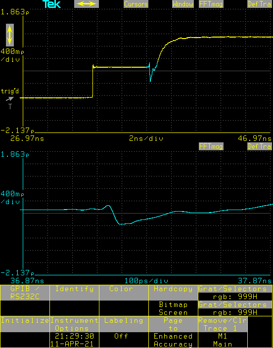

# Description

Tektronix CSA803C is a Digital Sampling Oscilloscope from 1990s. It has no networking or USB interface but it has a very flexible hardcopy feature that can send the screenshot to a printer or to COM port (or GPIB).

This (listen.py) is a small utility listening on COM port connected to CSA803C, captures the data when hardcopy key is pressed, and saves it to a folder. CSA803C sends the screenshot as TIFF and it is saved as such. Because the communication is slow, it takes around 100 seconds to save this image. There is also a TIFF Compacted format, but it seems it is not commonly supported by image viewer applications.

I am using this utility on a Raspberry Pi and saving the images to a samba share, so I can access the screenshots directly from Windows etc. listen.py also executes convert tool to convert tiff to png, and then deletes the tiff file.

# Sample

# Requirements

## listen.py

listen.py requires pyserial package.

There are hard-coded paths in the python file. It is not meant to be used as it is, but to be customized.

## CSA803C RS232C Parameters

## CSA803C Hardcopy Parameters

