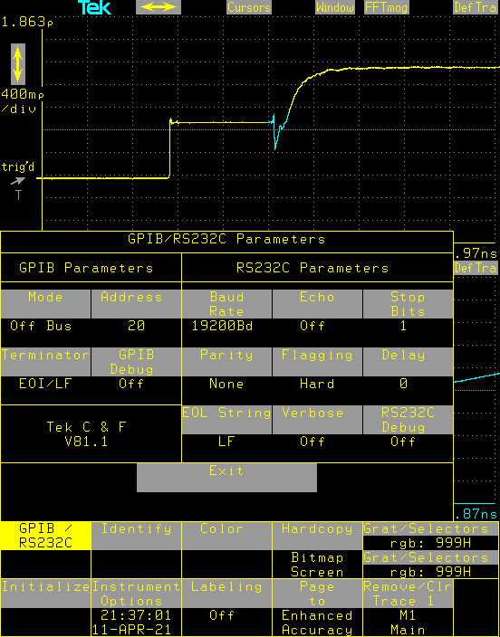
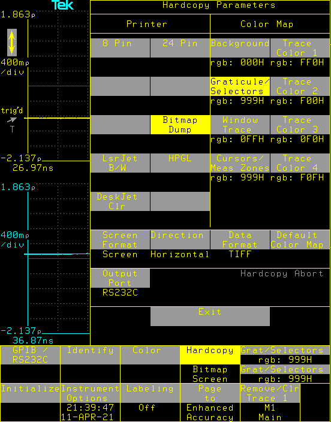

# Description

Tektronix CSA803C is a Digital Sampling Oscilloscope from 1990s. Naturally it has no networking or USB interface but it has a very flexible hardcopy feature that can send the screenshot to a printer or to COM port (or GPIB).

This (listen.py) is a small utility listening on COM port connected to CSA803C, captures the data when hardcopy key is pressed, and saves it to a folder. I am using this utility on a Raspberry Pi and saving the images to a samba share, so I can access the screenshots directly from Windows etc.

CSA803C sends the screenshot as TIFF and it is saved as such. Because the communication is slow, it takes around 100 seconds to save this image. There is also a TIFF Compacted format, but it seems it is not commonly supported by image viewer applications.

# Known Issues

There is a problem at the bottom of the images, I dont know yet the reason of this.

# Requirements

listen.py requires pyserial package.

It expects CSA803C RS232C is configured as below (this image is captured with this utility):

Also, it expects CSA803C hardcopy configured as below:

